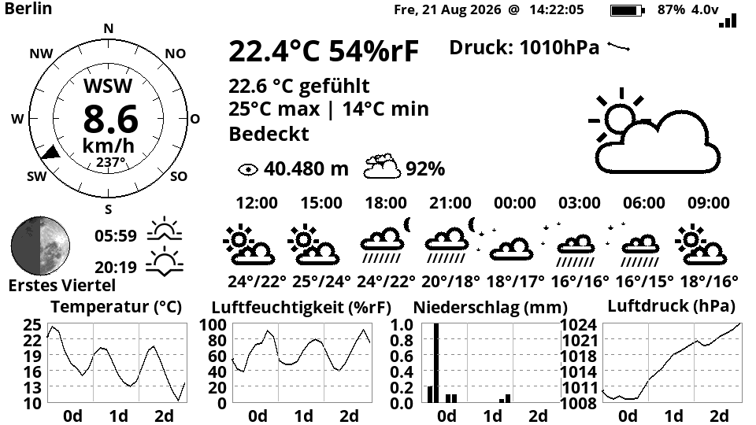
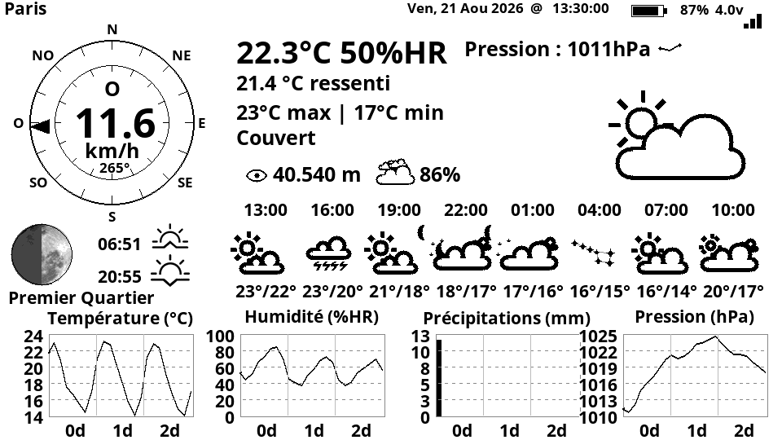
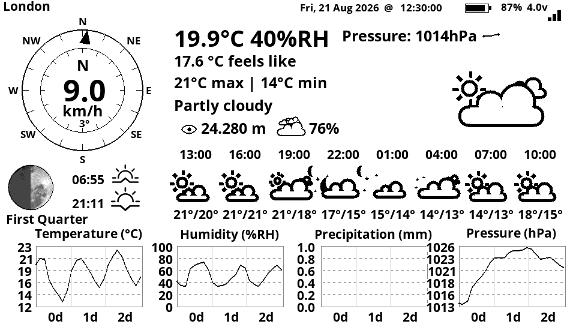

# LilyGo T5 4.7" E-Paper Weather Station

A battery-powered weather display for the LilyGo T5 4.7 inch e-paper board.
It wakes up every few minutes, fetches a forecast from Open-Meteo, redraws the
panel and returns to deep sleep.



*Rendered from the actual sketch code with live Open-Meteo data for Berlin —
the drawing routines, the library's font renderer and the MoonRise library were
compiled for the host and the framebuffer written out as a PNG, so this is what
the panel really shows.*

## Why Open-Meteo

This project uses [Open-Meteo](https://open-meteo.com) rather than a commercial
weather API, primarily for **forecast quality**.

Open-Meteo does not run a single global model. It selects the best available
model for the requested coordinates and blends the national weather services'
own high-resolution runs — DWD ICON-D2 at 2 km resolution for Central Europe,
Météo-France AROME, ECMWF, NOAA GFS and others. For a European location that is
substantially more precise than the coarse global grids many consumer weather
APIs resell, and it updates far more often.

Two practical benefits on top of that:

- **No API key and no account.** Free for non-commercial use, which also means
  no credentials have to live in this repository.
- **Everything in one request.** Current conditions, 75 hourly steps and daily
  sunrise/sunset arrive together, so the radio stays on for a couple of seconds
  per cycle instead of several.

Weather codes follow the WMO WW table exactly as Open-Meteo documents it.

## What it shows

- Current temperature, apparent temperature, humidity and today's high/low
- Air pressure with a six-hour trend as a mini graph
- Wind speed and direction on a compass rose
- Sunrise, sunset and the current moon phase, rendered over a photographic moon
  texture
- Eight three-hour forecast tiles with icons, times and high/low
- 72-hour graphs for temperature, humidity, precipitation and pressure. The
  precipitation bars are split: the black part is liquid, the grey part on top
  is snow. Over three days both can fall, so neither is hidden.
  `SNOW_AS_FALLEN_DEPTH` decides whether the snow share is drawn as the depth of
  fresh snow (default) or as its water equivalent
- WiFi signal strength and battery state of charge

## Hardware

Targets the **LilyGo T5-S3 (ESP32-S3)** 4.7 inch e-paper board. It also runs on
the classic T5 4.7 (ESP32) — only the battery ADC pin differs, see
`BATTERY_ADC_PIN`.

## Dependencies

### Board package

**ESP32 by Espressif Systems — version 2.0.x (2.0.17 recommended). Not 3.x.**

Arduino IDE → *Tools → Board → Boards Manager* → search `esp32` → pick version
`2.0.17` from the dropdown → *Install*.

The reason is the display library, not this sketch: LilyGo-EPD47 1.0.0 does not
build against ESP-IDF 5.1, which core 3.x is based on. Its `src/ed047tc1.h`
includes only `<driver/gpio.h>`, and up to IDF 4.4 that transitively provided
`esp_attr.h` and `soc/gpio_struct.h`. On core 3.x the build fails with
`IRAM_ATTR` and `GPIO` undeclared.

If you would rather stay on core 3.x, patch the library instead — add these two
lines to `ed047tc1.h` next to the existing `#include <driver/gpio.h>`:

```c
#include <esp_attr.h>          // IRAM_ATTR
#include <soc/gpio_struct.h>   // GPIO
```

The sketch itself compiles on both core generations.

### Libraries

| Library | Version | Install | Used for |
|---|---|---|---|
| [LilyGo-EPD47](https://github.com/Xinyuan-LilyGO/LilyGo-EPD47) | 1.0.0 | **Manually** — not in the Library Manager. Download the repository as a ZIP, then *Sketch → Include Library → Add .ZIP Library* | e-paper panel driver, fonts, drawing primitives |
| [ArduinoJson](https://github.com/bblanchon/ArduinoJson) by Benoit Blanchon | **7.x** | Library Manager | parsing the Open-Meteo response. Uses the elastic `JsonDocument`, so it will **not** build against 6.x |
| [MoonRise](https://github.com/signetica/MoonRise) by signetica | 2.x | Library Manager | works out whether the moon is above the horizon, for the crescent indicator in the weather icons |

`WiFi`, `HTTPClient` and `Wire` ship with the ESP32 board package — nothing to
install.

LilyGo-EPD47 declares `SensorLib` and `Button2` in its `library.properties`,
but those are only needed by its own touch and button examples. This sketch
builds without them.

## Configuration

```
cd src/OWM_EPD47
cp user_settings.h.example user_settings.h
```

Then edit `user_settings.h`: WiFi credentials, location, time zone, sleep
intervals, button pin and battery divider all live there. The file is listed in
`.gitignore`, so your credentials never end up in a commit.

Pick the display language at the bottom of that file — `lang.h` (English),
`lang_de.h` (German) or `lang_fr.h` (French). Weekday and month names, the
weather descriptions, the compass points and the graph titles all follow it:





*Same sketch, same moment, live Open-Meteo data — only `user_settings.h`
differs.*

**Battery calibration.** `BATTERY_DIVIDER` defaults to `2.0` (T5-S3, GPIO14).
Measure the pack voltage at the JST connector with a multimeter and compare it
against the `Battery: x.xx V` line on the serial monitor. If it is off by more
than 0.05 V, scale `BATTERY_DIVIDER` accordingly.

## Building and flashing

Open `src/OWM_EPD47/OWM_EPD47.ino` in the Arduino IDE.

| Setting | Value |
|---|---|
| Board | **ESP32S3 Dev Module** (classic T5 4.7: *ESP32 Dev Module*) |
| PSRAM | **OPI PSRAM** — required, the framebuffer is allocated with `ps_calloc()` and nothing is drawn without it |
| USB CDC On Boot | **Enabled** — otherwise the board does not enumerate as a serial port while awake, and upload mode below cannot be used |
| Flash Size | as per your board, e.g. 16MB |

## Uploading to a sleeping device

The board spends almost all of its time in deep sleep, so the window in which an
upload can start is very short — and at night it sleeps for hours in one
stretch. Two ways around that:

**Hardware, always works.** Hold **BOOT**, briefly press **RST**, release RST,
then release BOOT. The chip stays in the ROM download mode indefinitely and
never sleeps. Upload, then press RST once. This needs no firmware support at
all — use it whenever the device is unreachable.

**Button.** The user button (`WAKE_BUTTON_PIN`, GPIO21 on the T5-S3) is
registered as a deep-sleep wake source:

| Action | Result |
|---|---|
| Short press | Wakes up and refreshes immediately, even at night |
| Hold while powering up or resetting | Upload mode: stays awake `SERVICE_MODE_SECONDS` (120 s by default) and says so on the display |

After the upload window expires the device does a normal update, so the notice
does not stay on the panel.

## Behaviour

- Refreshes every **15 minutes** while it rains or the pressure is moving, every
  **45 minutes** in stable weather (`SLEEP_ACTIVE_MIN` / `SLEEP_STABLE_MIN`).
- Sleeps through the night in one stretch between `SLEEP_HOUR` and
  `WAKEUP_HOUR` instead of waking up pointlessly; the last image stays on the
  panel.
- On a WiFi, time or data error it shows a short message and retries after
  `SLEEP_ERROR_MIN` minutes.
- Weather icons follow Open-Meteo's `is_day`. Wherever a sun would stand during
  the day, something stands at night: the moon if it is above the horizon,
  stars if it is not — and on a clear night the Big Dipper, or Crux with
  `Hemisphere` set to `south`. Icons that never draw a sun, meaning rain, snow
  and thunderstorm, stay as they are.

- Independently of all that, a small crescent appears in the corner of every
  icon whenever the moon is above the horizon, including during the day. Each
  forecast tile evaluates this for its own hour.

## Credits

The code base has been passed along a few times — in order:

1. **[G6EJD](https://github.com/G6EJD/)** wrote the original ESP32 e-paper
   weather display this descends from.
2. **[DzikuVx/LilyGo-EPD-4-7-OWM-Weather-Display](https://github.com/DzikuVx/LilyGo-EPD-4-7-OWM-Weather-Display)**
   ported it to the LilyGo T5 4.7.
3. **[CybDis/Lilygo-T5-4.7-WeatherStation-with-HomeAssistant](https://github.com/CybDis/Lilygo-T5-4.7-WeatherStation-with-HomeAssistant)**
   added a Home Assistant/MQTT link and kept it building. **This repository is a
   fork of that one.**

What changed here: OpenWeatherMap replaced by Open-Meteo, weather codes
corrected to the WMO WW table, the ESP32-S3 battery path reworked, a
button-driven upload mode added, and the MQTT/Home Assistant integration
removed.

The display driver comes from [epdiy](https://github.com/vroland/epdiy) by way
of the LilyGo library.

## License

[GNU General Public License v3](./LICENSE).

The display driver this project links against, LilyGo-EPD47, is GPLv3, so the
combined work is GPLv3 as well. Attribution and copyright of the original
authors listed above are retained.
